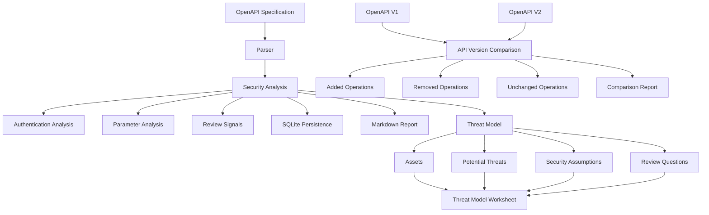

# Attack Surface Notebook

A Python-based security analysis tool for mapping API attack surfaces from OpenAPI specifications.

It extracts endpoints, authentication requirements, parameters, and explainable security review signals, stores structured analysis results in SQLite, generates Markdown reports, compares API versions, and produces threat-model worksheets for manual security review.

> Review signals and threat scenarios are heuristic indicators for prioritizing manual security review. They are not confirmed vulnerabilities.

## Problem Statement

Security engineers often need to inspect APIs and understand their attack surface before performing a security review.

This project analyzes OpenAPI specifications and extracts structured security-relevant information such as endpoints, authentication requirements, parameters, review signals, API version changes, and threat-model review questions.

The goal is to support manual security review with organized evidence, not to claim automatic vulnerability discovery.

## Current Status

The project currently provides a Python CLI for loading, validating, analyzing, storing, reporting, comparing, and threat-modeling OpenAPI JSON specifications.

Implemented functionality:

- Load and validate OpenAPI JSON specifications
- Extract HTTP methods and endpoint paths
- Analyze authentication requirements
- Support global and operation-level security requirements
- Extract path-level and operation-level parameters
- Merge inherited parameters and support operation-level overrides
- Tag endpoints with explainable security review signals
- Store endpoints, authentication requirements, parameters, and review signals in SQLite
- Prevent duplicate analysis records
- Generate Markdown attack surface analysis reports
- Compare two OpenAPI versions using HTTP method and path identity
- Detect added, removed, and unchanged API operations
- Generate Markdown API version comparison reports
- Generate structured API threat-model worksheets
- Infer assets, potential threats, security assumptions, and review questions from available analysis evidence
- Avoid confirmed vulnerability claims without runtime evidence
- Automated testing using pytest
- Harden OpenAPI input validation against malformed structures
- Handle partial and minimal analysis metadata safely
- Test threat-model inference against duplicate and incomplete inputs
- Test report generation with empty and minimal analysis results

Current test suite: 80 tests passing.

## Architecture



## SQLite Persistence

Analysis results can be stored locally in `attack_surface.db`.

The database stores:

- API endpoints
- Authentication requirements
- Parameters
- Review signals

Related analysis data is linked to its endpoint using foreign keys.

Endpoint identity is based on the combination of HTTP method and path.

For example:

```text
GET /users
DELETE /users
```

are treated as different API operations.

Parameterized SQL queries are used when inserting and retrieving values.

## Markdown Reports

The project generates Markdown reports containing:

- API summary
- Endpoint inventory
- Authentication requirements
- Parameter metadata
- Review signals
- Threat-model worksheet
- Analysis limitations

The reports distinguish heuristic review signals and potential threats from confirmed security findings.

## Threat Model Worksheet

The analysis workflow can generate a structured threat-model worksheet for each API operation.

The worksheet may contain:

- Assets
- Potential threats
- Security assumptions
- Review questions

Threat-model content is generated conservatively from available OpenAPI analysis evidence.

For example:

```text
Operation:
POST /admin/users

Assets:
- User/account data
- Administrative capabilities

Potential Threat:
- A lower-privileged authenticated user may attempt to invoke an administrative operation.

Security Assumption:
- Administrative operations require appropriate administrative authorization.

Review Question:
- Can a non-admin authenticated user successfully invoke POST /admin/users?
```

Threat scenarios are questions about what could go wrong. They are not confirmed vulnerabilities.

Runtime evidence and authorized testing are required before documenting a confirmed security finding.

## API Version Comparison

The CLI can compare two OpenAPI specifications and classify API operations as:

- Added
- Removed
- Unchanged

API operation identity is based on:

```text
(method, path)
```

For example:

```text
V1:
GET /users
DELETE /legacy

V2:
GET /users
POST /admin/users
```

The comparison identifies:

```text
Added:
POST /admin/users

Removed:
DELETE /legacy

Unchanged:
GET /users
```

New operations are treated as newly introduced attack surface requiring review, not as confirmed vulnerabilities.

## Review Signal Limitations

Review signals are heuristic indicators intended to help prioritize manual security review.

Examples include:

- `user-data`
- `admin-surface`
- `authentication-related`
- `destructive-operation`
- `sensitive-input`

These signals do not represent confirmed vulnerabilities.

A signal indicates that an endpoint may deserve additional review, but further evidence and authorized testing are required before making a security finding.

The project distinguishes between:

```text
Observation
    ↓
Review Signal / Heuristic
    ↓
Threat / Review Question
    ↓
Authorized Testing + Evidence
    ↓
Confirmed Finding
```

## Running the CLI

Run the project from the repository root:

```powershell
python -m src.cli
```

The CLI provides two modes:

```text
1. Analyze API
2. Compare API versions
```

### Analyze API

This mode analyzes one OpenAPI specification.

It currently:

- Parses API operations
- Analyzes authentication requirements
- Extracts parameters
- Generates review signals
- Stores structured analysis results in SQLite
- Generates a threat-model worksheet
- Generates a Markdown attack surface report

### Compare API Versions

This mode compares an old and new OpenAPI specification and generates a Markdown report showing added, removed, and unchanged API operations.

## Testing

Run the full test suite:

```powershell
python -m pytest
```

Current test suite:

```text
80 tests passing
```

Tests cover:

- OpenAPI loading and validation
- Endpoint parsing
- Authentication analysis
- Parameter inheritance and overrides
- Review signal generation
- SQLite persistence
- Markdown report generation
- API version comparison
- Comparison report generation
- Threat-model generation
- Threat-model report output
- Conservative handling of authentication-related endpoints
- Context-aware authorization review questions
- Malformed OpenAPI structure validation
- Partial and minimal analysis metadata
- Duplicate review-signal handling
- Empty and minimal report generation

## Example Outputs

Sanitized example outputs are available in:

- `docs/sample_attack_surface_report.md`
- `docs/sample_comparison_report.md`

These examples demonstrate the analysis, review-signal, threat-model, and API-version-comparison output without representing confirmed vulnerabilities.

## Known Limitations

- OpenAPI documentation may not reflect the application's actual runtime security controls.
- Missing authentication declarations do not prove that an endpoint is unauthenticated in production.
- Review signals and threat scenarios are heuristic and require manual validation.
- Threat-model generation is based only on currently available analysis evidence and may miss application-specific context.
- The current threat model does not represent confirmed vulnerabilities.
- Some intentionally public endpoints may still generate low-value authentication review questions.
- API version comparison currently focuses on HTTP method and path changes.
- Changes to request bodies, schemas, authentication requirements, and parameter definitions are not yet included in version comparison.
- Runtime authorization behavior cannot be proven from an OpenAPI specification alone.

## Planned Features

- Export HTML reports
- Add HAR file support
- Improve context-aware threat-model inference
- Extend API version comparison beyond method and path changes

## Ethical Use

This project is intended for defensive security, security education, local laboratories, systems you own, and security assessments where you have explicit authorization.

Do not use this project to test systems without permission.